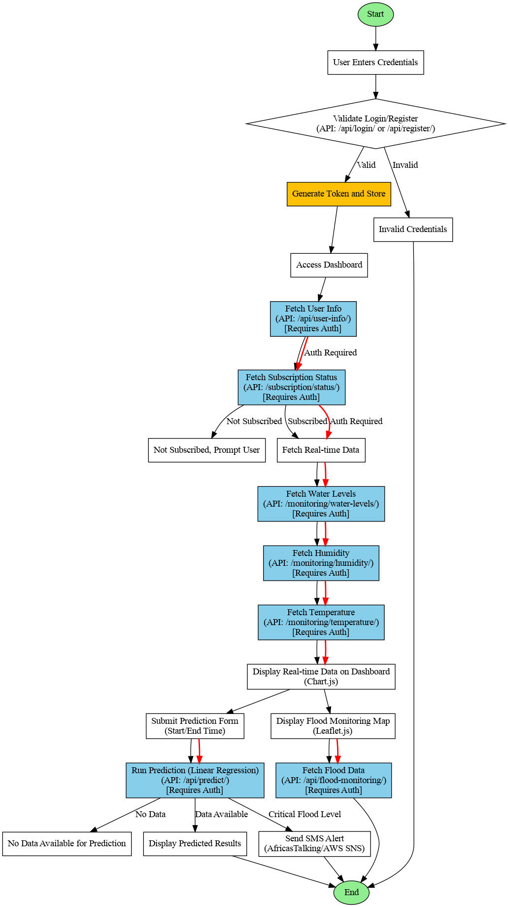

Updates - Install axios

`npm install axios`

`pip install djangorestframework`

## Models

- Database
  - MongoDb
  - Postgress
  - MYSQL
  - Redis (GIS)
- Payment.
  - MPESA, Banking (Equity, Coop, KCB)
  -
- SMS
  - AfricasTalking
- Flood Monitoring
  - Linear Regression,
  -
- GIS - (New comer)
- Analysis.
- Invoicing
- Prediction
- User Auth
- Subscription management

## Models to work on 

## TODOs

- Reduce subscription plans to three (Trial, Premium and Corporate)
- Redesign Login/Register pop up in new folder(login)
- Payment folder

## Work Log 

## Flow Chart 

## Gunicorn to always run 

Supervisor Configuration /etc/supervisor/conf.d/floodsys.conf:

  [program:floodsys]

  command=/home/freak/.venv/bin/gunicorn --config /home/freak/Documents/floodsys/auth/gunicorn_config.py auth.wsgi:application

  directory=/home/freak/Documents/floodsys/auth

  user=your_user

  autostart=true

  autorestart=true

  stderr_logfile=/var/log/supervisor/floodsys.err.log

  stdout_logfile=/var/log/supervisor/floodsys.out.log

`sudo supervisorctl reread`

`sudo supervisorctl update`

`sudo supervisorctl start floodsys`